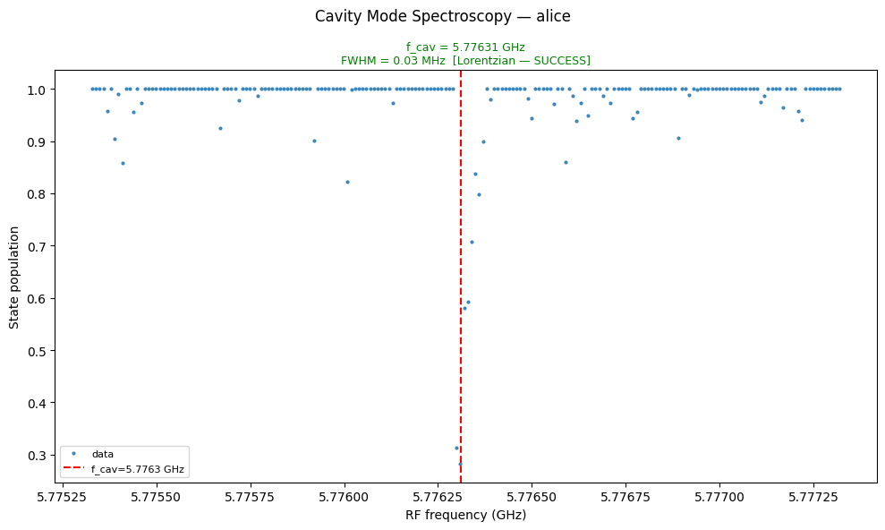
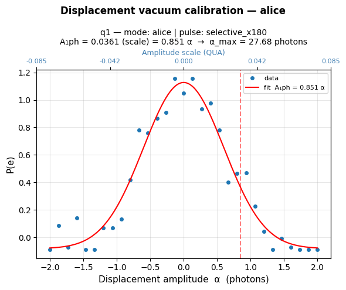
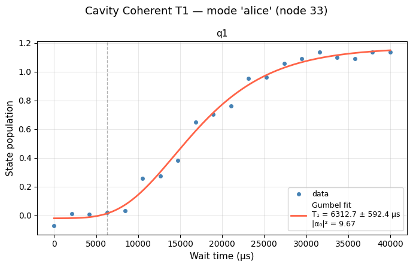
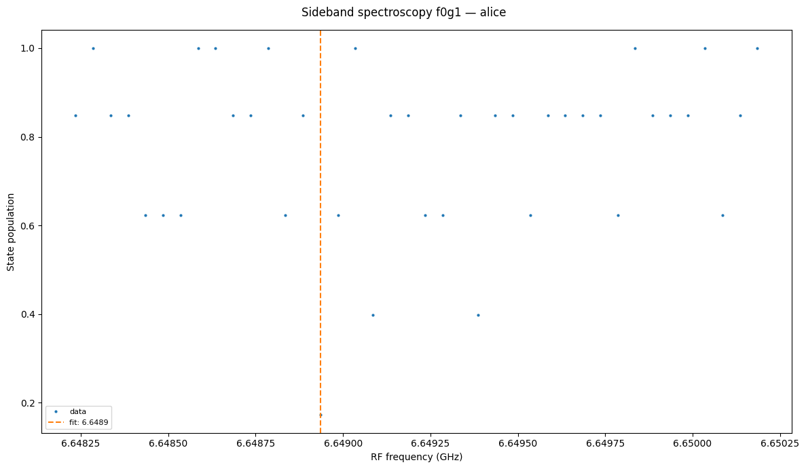
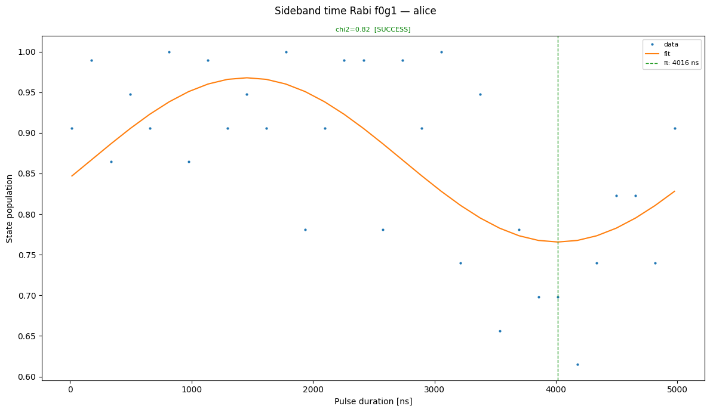
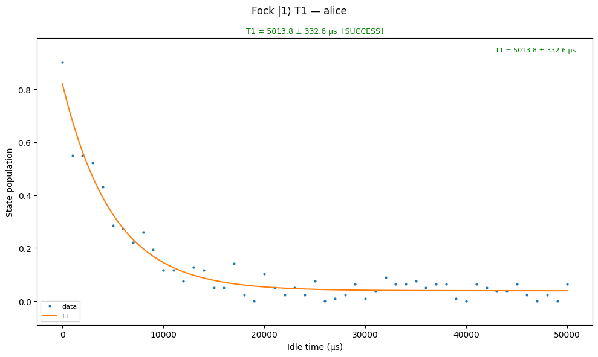
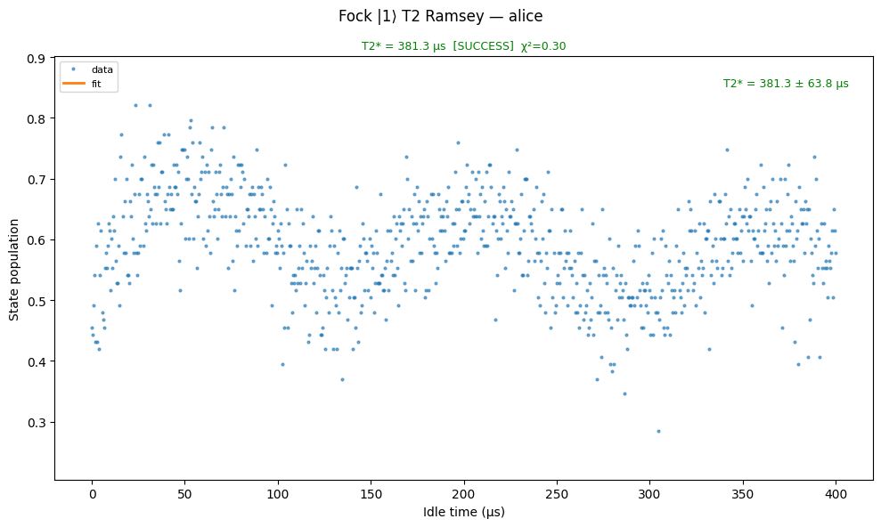
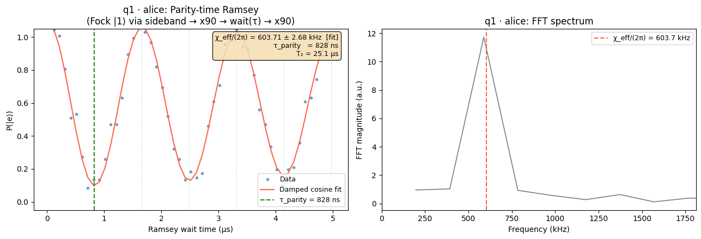
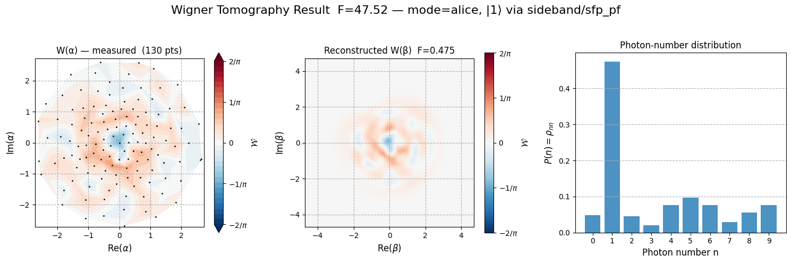

# Cavity Calibrations

This folder contains calibration nodes for **SRF transmon-cavity systems** (e.g. NQI-SQMS TE62FNAL cryostat). These nodes are built on top of the standard QUA-Libs calibration framework and target experiments specific to bosonic quantum error correction (QEC): dispersive coupling characterization, cavity coherence measurements, Wigner tomography, and parity-time calibration.

The qubit-cavity system targeted by these nodes consists of a superconducting transmon qubit dispersively coupled to a high-Q storage cavity (SRF or 3D microwave). The dispersive interaction χ shifts the qubit frequency by χ per photon in the cavity, enabling photon-number-resolved readout and Fock-state control.

---

## Calibration node reference

| Node | File | Purpose |
|------|------|---------|
| 02 | `02_cavity_mode_spectroscopy.py` | Find the bare cavity resonance frequency via dispersive detection |
| 03 | `03_displacement_calibration_vacuum.py` | Calibrate the displacement drive amplitude for the vacuum state |
| 04 | `04_cavity_coherent_T1.py` | Measure T₁ of a coherent cavity state (Gumbel decay) |
| 05 | `05_photon_number_resolved_spectroscopy.py` | Map χ per Fock level via photon-number-resolved qubit spectroscopy |
| 06 | `06_displacement_calibration_pnrs.py` | Refine displacement calibration using photon-number-resolved spectroscopy |
| 07 | `07_fNgN1_spectroscopy.py` | Spectroscopy of the |f,N⟩ ↔ |g,N+1⟩ sideband (f0g1, f1g2, …) |
| 07a | `07a_dispersive_shift.py` | Measure the dispersive shift χ (qubit GE transition) |
| 07b | `07b_dispersive_shift_gef.py` | Measure χ for GEF levels (qubit in |e⟩ or |f⟩) |
| 07b | `07b_fNgN1_time_rabi.py` | Time-domain Rabi on the |f,N⟩ ↔ |g,N+1⟩ sideband |
| 07c | `07c_fNgN1_ramsey.py` | Ramsey experiment conditioned on cavity photon number |
| 07d | `07d_fNgN1_ge_iq_blobs.py` | IQ blobs for GE discriminator conditioned on Fock state N |
| 07e | `07e_fNgN1_qubit_ge_spectroscopy.py` | Qubit GE spectroscopy conditioned on cavity Fock state N |
| 07f | `07f_fNgN1_ge_ramsey.py` | GE Ramsey conditioned on cavity Fock state N |
| 07g | `07g_fNgN1_qubit_ef_spectroscopy.py` | Qubit EF spectroscopy conditioned on cavity Fock state N |
| 07h | `07h_fNgN1_ef_ramsey.py` | EF Ramsey conditioned on cavity Fock state N |
| 07i | `07i_fNgN1_resonator_spectroscopy.py` | Readout resonator spectroscopy conditioned on cavity Fock state N |
| 07j | `07j_coherent_ge_iq_blobs.py` | IQ blobs for GE discriminator in presence of a coherent cavity state |
| 08 | `08_cavity_coherent_T2.py` | Measure T₂ of a coherent cavity state (Ramsey-style) |
| 09 | `09_parity_time_measurement.py` | Calibrate the parity-time t_parity for Wigner tomography |
| 10 | `10_displacement_wigner_calibration.py` | Calibrate displacement using Wigner function extremum |
| 11 | `11_cavity_fock1_T1.py` | Measure T₁ of the |1⟩ Fock state (prepared via sideband π) |
| 12 | `12_cavity_fock1_T2.py` | Measure T₂ of the |1⟩ Fock state (Ramsey-style) |
| 13 | `13_cavity_reset_test.py` | Verify cavity active reset fidelity |
| 14 | `14_wigner_tomography_2d.py` | Full 2D Wigner function tomography with MLE reconstruction |
| 15 | `15_qubit_gef_thresholds.py` | Calibrate GEF readout thresholds via LDA on IQ data |
| 16 | `16_active_gef_reset_test.py` | Verify active GEF reset fidelity |
| 17 | `17_cavity_bringup_graph.py` | Orchestrated bring-up graph for a new cavity mode |
| 18 | `18_sideband_bringup_graph.py` | Orchestrated bring-up graph for the f0g1 sideband transition |
| 19 | `19_sideband_retuning_graph.py` | Adaptive retuning graph for the sideband transition |
| 20 | `20_cavity_retuning_graph.py` | Full cavity retuning orchestration graph |

### Bring-up order

For a fresh qubit-cavity system:

```
02 → (07a, 07b) → 03 → 05 → 06 → 07 → 07b_time_rabi
     ↓
   04, 08          ← coherence characterization
     ↓
   09 → 10 → 14   ← Wigner tomography pipeline
     ↓
   11, 12          ← Fock |1⟩ coherence
```

Use graphs `17` (cavity bringup), `18` (sideband bringup), `19` (sideband retuning), and `20` (cavity retuning) to automate these sequences.

---

## calibration_utils modules

Each node delegates analysis, plotting, and parameter management to a corresponding submodule in `calibration_utils/`:

| Module | Files | Purpose |
|--------|-------|---------|
| `cavity_mode_spectroscopy/` | analysis, parameters, plotting | Lorentzian fit to cavity resonance |
| `cavity_coherent_T1/` | analysis, parameters, plotting | Gumbel decay fit for T₁ in coherent state |
| `cavity_coherent_T2/` | analysis, parameters, plotting | Exponential-cosine fit for T₂ in coherent state |
| `cavity_fock1_T1/` | analysis, parameters, plotting | Exponential decay fit for Fock |1⟩ T₁ |
| `cavity_fock1_T2/` | analysis, parameters, plotting | Exponential-cosine fit for Fock |1⟩ T₂ |
| `cavity_reset_test/` | analysis, parameters, plotting | Reset fidelity metrics |
| `cavity_rabi/` | analysis, parameters, plotting | Cavity Rabi oscillation fit |
| `displacement_calibration_vacuum/` | analysis, parameters, plotting | Vacuum displacement amplitude calibration |
| `displacement_calibration_pnrs/` | analysis, parameters, plotting | PNRS-based displacement refinement |
| `displacement_wigner_calibration/` | analysis, parameters, plotting | Wigner-extremum displacement calibration |
| `photon_number_resolved_spectroscopy/` | analysis, parameters, plotting | Per-Fock-level χ mapping |
| `dispersive_shift/` | analysis, parameters, plotting | χ extraction from qubit spectroscopy |
| `dispersive_shift_gef/` | analysis, parameters, plotting | χ extraction for GEF levels |
| `fNgN1_spectroscopy/` | analysis, parameters, plotting | Sideband spectroscopy fit |
| `fNgN1_time_rabi/` | analysis, parameters, plotting | Sideband Rabi fit |
| `fNgN1_ramsey/` | parameters | Ramsey parameters (Fock-conditioned) |
| `fNgN1_ge_iq_blobs/` | parameters | IQ blob parameters (Fock-conditioned) |
| `fNgN1_qubit_ge_spectroscopy/` | analysis, parameters, plotting | GE spectroscopy conditioned on N |
| `fNgN1_ge_ramsey/` | parameters | GE Ramsey parameters (Fock-conditioned) |
| `fNgN1_qubit_ef_spectroscopy/` | analysis, parameters, plotting | EF spectroscopy conditioned on N |
| `fNgN1_ef_ramsey/` | parameters | EF Ramsey parameters (Fock-conditioned) |
| `fNgN1_resonator_spectroscopy/` | analysis, parameters, plotting | Resonator spectroscopy conditioned on N |
| `coherent_ge_iq_blobs/` | parameters | IQ blobs in coherent state (GE) |
| `parity_time_measurement/` | analysis, parameters, plotting | t_parity and χ_eff fit |
| `wigner_tomography_2d/` | analysis, dataset, parameters, plotting | MLE Wigner reconstruction + photon statistics |
| `qubit_gef_thresholds/` | analysis, parameters, plotting | LDA threshold calibration for GEF |
| `active_gef_reset_test/` | parameters | Active reset verification parameters |

---

## Example results

### Cavity mode spectroscopy (node 02)
Lorentzian fit to the cavity resonance. Drives the cavity while reading out the qubit via the dispersive interaction.



### Displacement calibration — vacuum state (node 03)
Sweeps the displacement amplitude and fits the photon-number distribution to calibrate |α|² vs. DAC amplitude.



### Cavity coherent T₁ (node 04)
Gumbel-shaped decay of a coherent state, giving T₁ ≈ 6.3 ms and mean photon number |α₀|² ≈ 9.67.



### Sideband spectroscopy f0g1 (node 07)
Identifies the |f,0⟩ ↔ |g,1⟩ transition frequency used for Fock-state preparation and the sideband bringup.



### Sideband time-Rabi f0g1 (node 07b)
Calibrates the π-pulse duration on the |f,0⟩ ↔ |g,1⟩ sideband to prepare the |1⟩ Fock state.



### Fock |1⟩ T₁ (node 11)
Exponential decay of the |1⟩ Fock state, giving T₁ ≈ 5.0 ms.

 T1 decay">

### Fock |1⟩ T₂ (node 12)
T₂ of the |1⟩ Fock state measured via Ramsey-style experiment.

 T2 Ramsey">

### Parity-time calibration (node 09)
Calibrates χ_eff and t_parity from the qubit Ramsey frequency while the cavity holds a |1⟩ Fock state.



### Wigner tomography 2D (node 14)
Full 2D Wigner function reconstruction of a |1⟩ Fock state: measured raw W(α), reconstructed W(β) via MLE, and photon-number distribution.

 state: raw, reconstructed, and photon statistics">

---

## QUAM components

The nodes use QUAM components defined in `quam-builder`:

- **`CavityMode`** — storage cavity mode with `displacement()`, `snap_gate()`, and `cavity_mode_drive`
- **`CavityTransmonPair`** — qubit-cavity pair with `sideband_drive`, `transitions`, `parity_time`, `parity_contrast`, and `play_sideband_flattop()`
- **`SNAPElementDrive` / `SNAPElementDriveMW`** — Fock-level selective drives with live χ-tracking via QUAM references
- **`SNAPGate`** — orchestrates multi-element SNAP pulses

See `quam_builder/architecture/superconducting/cavity/` and `quam_builder/architecture/superconducting/qubit_pair/cavity_transmon_pair.py`.

---

## Hardware compatibility

| Hardware | Status |
|----------|--------|
| OPX+ + Octave | Supported (IQ mixer path) |
| OPX1000 with MW-FEM | Supported (direct MW path via `SNAPElementDriveMW`) |

Wiring examples for both configurations are in `quam_config/wiring_examples/`.
